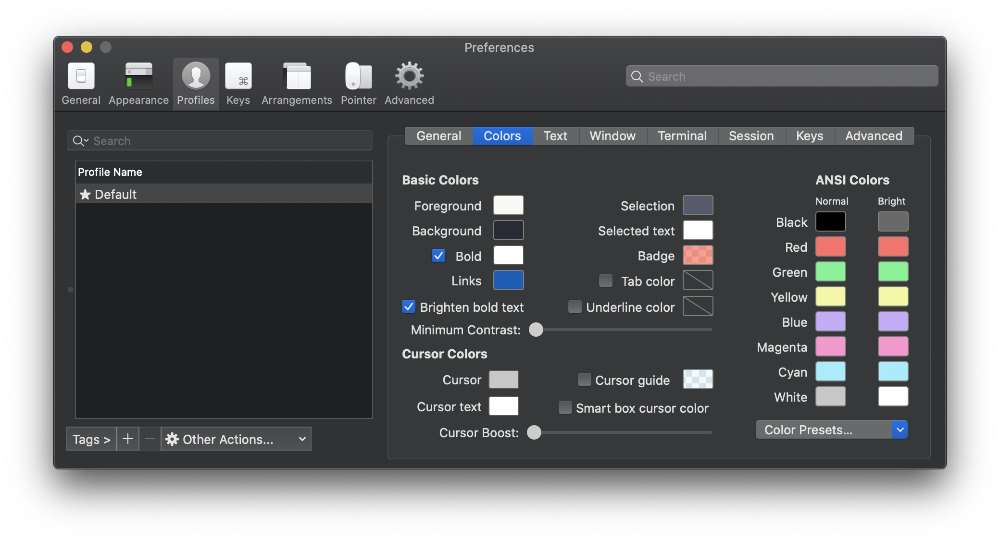
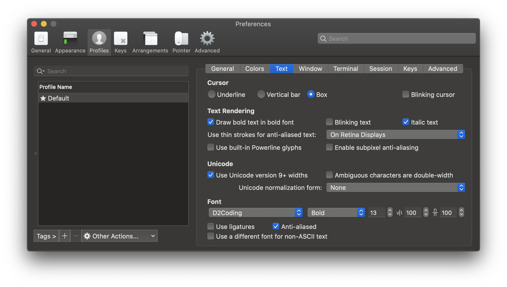

## Mac 초기 셋팅

<br>

#### **Terminal 커스텀 하기**

 맥의 CLI인 **Terminal**을 커스텀 해보자.

* **iTerm2**
* **zsh, oh-my-zsh shell**

<br>

***

✅ **iTerm2**

🔵 **iTerm2 설치방법 2가지**

1. **[iTerm2 설치](https://iterm2.com/)** 홈페이지로 들어가서 설치
2. **homebrew** 설치 후, `brew cask install iterm2` 명령어 실행

<br><br>

🔵 **iTerm2 테마 적용**

 [iTerm2 여러 테마](https://github.com/mbadolato/iTerm2-Color-Schemes) 중 원하는 테마를 선택한다. 선택 후, 다운로드한다.

1. iTerm2 실행 후, (`⌘` + `,`) 설정창에서 `Profile`항목의 `Color`탭을 선택한다.



2. 우측 하단의 `Color Presets...` 메뉴의 `Import`항목을 선택 후,  다운받은 iTerm2 테마를 선택한다. 다운받은 테마란 *Schemes*의 ***.itemcolors*** 확장자로 된 파일이다.
3. `Import`가 완료된 후, `Color Presets...`메뉴에서 import한 테마를 선택한다.

<br><br>

***

✅ **zsh**, **oh-my-zsh** 이용 shell 바꾸어서 기능 설정

 Mac OS의 Terminal 기본 Shell은 `Bash(Bourne-again)`이다. 이것을 `zsh Shell`로 바꾸어줄 것이다. 우선 ***Homebrew***을 설치하여 준다.

**zsh, oh-my-zsh 설치 방법**

1. ***[HomeBrew](https://brew.sh/index_ko)*** 홈페이지에 접속하여 설치하는 법을 보고 따라한다.

> 👉 ***Homebrew란?*** 맥북의 패키지 관리자. 즉, 원하는 프로그램들을 명령어로 쉽게 설치하고 삭제하고 업데이트할 수 있게 도와준다.

2. ***Homebrew***설치가 완료되었으면 `zsh`을 설치하여 준다.

```shell
brew install zsh
brew install zsh zsh-completions
```

3. `zsh`의 설정을 쉽게 하게 관리해주는 `oh-my-zsh` 역시 설치한다.

```shell
sh -c "$(curl -fsSL https://raw.github.com/robbyrussell/oh-my-zsh/master/tools/install.sh)"
```

<br><br>

🔵 **oh-my-zsh 플러그인 설정**

 oh-my-zsh의 좋은 기능은 zsh shell의 플러그인 설정등에 있다. 여기서 자주 사용하는 2가지의 플러그인을 설치해볼 것이다.

* `zsh-syntax-highlighting` : 명령어 하이라이팅 기능을 가진 플러그인
* `zsh-autosuggestions` : 명령어 자동완성 기능을 가진 플러그인

1. ***plug-in***을 설치

```shell
# zsh-syntax-highlighting 기능 설치
git clone https://github.com/zsh-users/zsh-syntax-highlighting.git ${ZSH_CUSTOM:-~/.oh-my-zsh/custom}/plugins/zsh-syntax-highlighting

# zsh-autosuggestions 플러그인 설치
git clone git://github.com/zsh-users/zsh-autosuggestions $ZSH_CUSTOM/plugins/zsh-autosuggestions

```

2. 설치 후, `zsh` 파일에 설정이 필요하다. `zsh`설정을 위해서는 `~/.zshrc` 파일을 설정하여야 한다.

```shell
# ~/.zshrc 파일 vi 에디터로 실행
vi ~/.zshrc

# 파일이 열리고 난 후, 밑의 코드 추가
plugins=(
  git
  zsh-syntax-highlighting
  zsh-autosuggestions
)
```

3. 설정이 완료되고 설정을 적용하기 위해서 `source ~/.zshrc` 명령어로 설정을 다시 불러온다.

<br>

**설정 완료 화면**

* ***zsh-syntax-highlighting*** : 알 수 없는 명령어에는 빨간색으로 **highlighting**이 적용되고, 완성된 명령어에는 초록색으로 **highlighting**이 적용된다.
* ***zsh-autosuggestions*** : 이전에 입력을 했던 명령어나 비슷한 명령어 중에 사용자가 사용할 것 같은 명령어를 자동 추천해준다. 추천해주는 부분은 연한 회색으로 표시된다. 사용을 위해 회색이 표시되었을 때, 키보드 → 을 눌러준다. 


<br>

<br>

🔵 **oh-my-zsh 테마 적용**

 초기에 `oh-my-zsh`을 설치하면 `robbyrussell`로 적용이 되어있다. 다른 테마로 바꾸기 위해서 방법을 알아볼 것이다.

1. `vi ~/.zshrc`로 zsh 설정파일을 열어준다.
2. 파일 내용 중, `ZSH_THEME="robyrussell"`로 된 부분을 찾아서 원하는 테마로 수정해준다. ***agnoster*** 테마로 적용하였다. 켜질 때마다 새로운 것을 원하는 사람은 ***random***으로 적용하면 된다. 
3. 완료된 설정을 적용하기 위해 `source ~/.zshrc`을 실행시킨다.

<br>

❗️ 여기서 테마는 성공적으로 적용되지만 폰트가 깨지는 모습을 볼 수 있다. 이를 해결하기 위해, 폰트를 적용해주어야 한다.

 여기서는 ***D2CodingFont***을 사용하였다. 원하는 폰트가 있을 시, 자유롭게 다운하여 설정하면 된다. 우선 ***D2CodingFont*** 적용을 위한 방법을 알려주겠다.

👉 [D2CodingFont](https://github.com/naver/d2codingfont) 다운을 위해 다음 링크로 들어가 최신으로 설치한다.

👉 MacBook의 **서체관리자**을 열어서 다운받은 폰트를 추가하여 준다.

<br>

 이제 ***iTerm2***에 해당 서체를 적용하여야한다. `⌘(command) + ‚`을  눌러 설정 창을 열어준다. 설정 창의 ***Text*** 메뉴를 클릭하여 들어간다.



 이후, **서체관리자**에 추가하였던 폰트를 우측하단에서 선택하여준다. 이후 설정을 종료하면 해당 폰트가 적용된 것을 볼 수 있다.

<br>

<br>

🔵 **PROMPT 설정**

 Terminal을 사용하다보면 `yundongmin@yundongmin-ui-Macbook-Pro`와 같은 부분이 Shell앞에 표시되어 불편하다. 이 부분을 ***prompt***라고 부른다. 이 부분을 수정하기 위한 작업이있다.

1. `vi ~/.zshrc` 실행
2. 다음과 같은 명령어를 채운다.

```shell
prompt_context() {
  if [[ "$USER" != "$DEFAULT_USER" || -n "$SSH_CLIENT" ]]; then
    prompt_segment black default "%(!.%.)$USER"
  fi
}

// 여기서 만약 유저이름을 전부 숨기고 PROMPT 부분에 아무것도 표시하고 싶지 않으면 {} 사이에 아무 것도 넣지 않는다.
prompt_context() {}

```

	3. 설정이 완료되었으면 `source ~/.zshrc`로 재실행시킨다.


<br>

<br>

🔵 **CLI Application 설정**

1. **vim**

> **vim**은 기본으로 CLI의 텍스터 Editor로 생각할 수 있다. **vi**는 `Visual display Editor`에서 유래되었다. **vim**은 `VI Improved`에서 나왔다. 즉, **향상된 vi**을 의미한다고 볼 수 있다.

<br>

👉 **vim** 커스텀을 위한 **neovim**설치

 내장된 vim 대신 사용할 neovim을 설치해준다. vim과의 차별점은 컬러가 지원이 되어서 기존 흰색만 있던 **vi**환경보다 조금 더 구분을 하기 편하다.

```shell
brew install neovim
brew Tap homebrew/cask-fonts
brew cask install font-hack-nerd-font
```

<br>

👉 설치한 **neovim**을 기본 에디터로 셋팅

 설치를 완료한 **neovim**을 기본 에디터로 지정하기 위해 `vi ~/.zshrc`을 실행해 **alias**부분에 다음과 같은 코드를 적어준다.

```shell
alias vim="nvim"
alias vi="nvim"
alias vimdiff="nvim -d"
export EDITOR=/usr/local/bin/nvim
```

 이후 `source ~/.zshrc` 명령어를 실행해 변경한 것을 Terminal에 적용시켜준다. 이렇게 하면 **nvim**설치와 셋팅은 완료되었다.

<br>

👉 **vim**에도 플러그인을 설치해준다. 설치안해주어도 된다. 선택이다. 보통 **SpaceVim**이란 플러그인을 자주 사용한다.

```shell
curl -sLf https://spacevim.org/install.sh | bash
```

 설치완료 후, `vi "파일이름"`으로 **vi 에디터** 실행한다. 최초 실행 시 모드 설정에서 *1번*을 선택한다.


