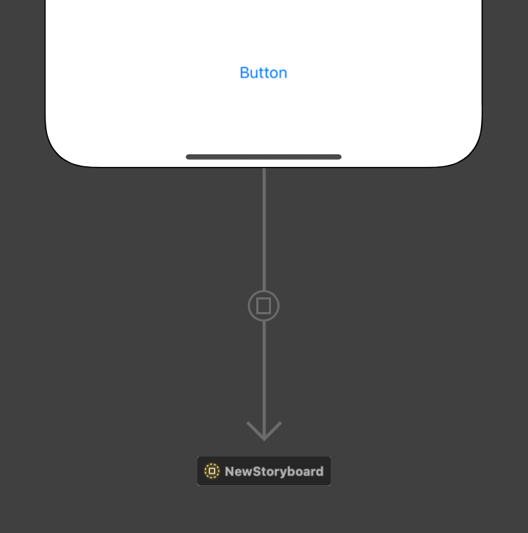
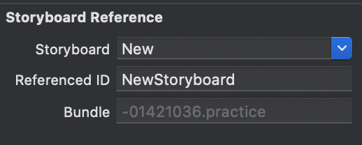

# Storyboard 관련

🔵 **Storyboard 이용 전환**

1️⃣ 새로운 Storyboard 파일을 만든다.

2️⃣ 새로운 Storyboard 파일의 ViewController에 `is Initial View Controller` 을 지정해준다. (❌ 필수는 아닌 것 같은데 일단 지정)

3️⃣ **StoryBoard ID**로 화면을 전환하기 때문에 다음과 같이 체크하고 ID을 지정해준다.

4️⃣ 전환할 Storyboard로 넘어가서 `Storyboard Reference`을 생성하여준다. 해당 Storyboard의 `Inspector`에서 전환될 **Storyboard 이름**을 입력하고 해당 **Storyboard의 Reference ID**을 지정해준다.

