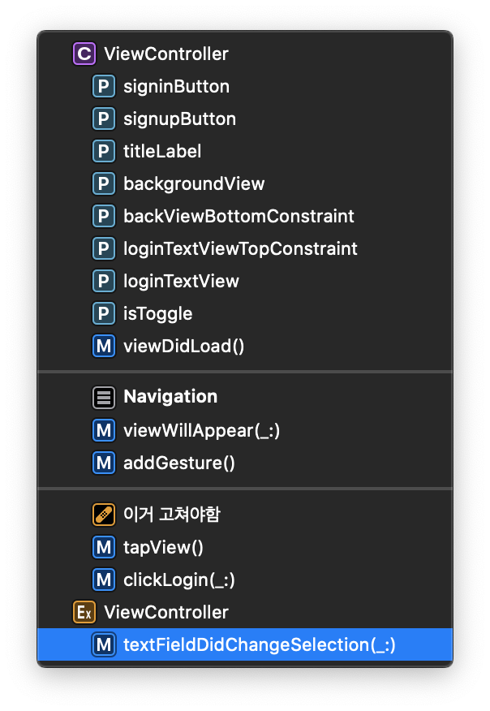

## XCode 주석 활용하기

***Xcode의 주석 기능을 활용해보자***

> 주석을 활용한다고 하면 기본적으로는 2가지 방법을 사용하였었다. "//", /* */로 구분하는 두 가지 방법이 있었다. 그러나 협업을 할 때, 코드가 길어졌을 때 좀 더 효율적으로 코드를 찾기 위해 Xcode의 기능들을 찾아보게 되었다.

<br>

 기본적으로 자주 활용했던 방법은 `Extension`이 있다. `Extension`의 경우에는 따로 등록하지 않아도 자동으로 메소드를 찾을 수 있게 지원이 된다.

 밑의 그림을 확인하게 되면 ***Ex***로 자연스럽게 `Extension`에 작성한 서브 스크립트는 아래의 구문에 들어가는 것을 알 수 있다.

<center></center>

<br>

이제 이 외에 추가적인 기능에 대해 알아볼 것이다. 찾아본 것 중에는 총 3가지의 구분법이 있었다.

1️⃣ ***MARK: -***

2️⃣ ***FIXME: -***

3️⃣ ***TODO: -***

```swift
// MARK: - 여기서부터는 TableView 관련
// FIXME: - 고쳐야하는 지점
// TODO: - 구현해야하는 부분
```

<br>

 다음과 같이 사용할 수 있다. 여기서 주의해야할 점은 꼭 세미콜론은 앞에 붙여써야한다는 것이다. 추가로 `-`을 사용하지 않아도 된다. 사용하고 안하고의 차이는 구분선이 생기고 안생기고의 차이이다.

<br>

 이렇게 주석을 활용해서 협업을 할 때, 조금 더 효율적으로 코드를 찾고 구분할 수 있을 것 같다.


