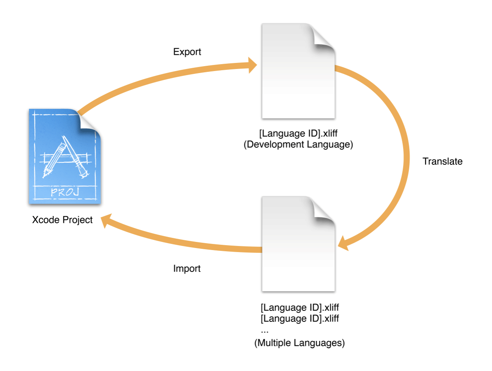
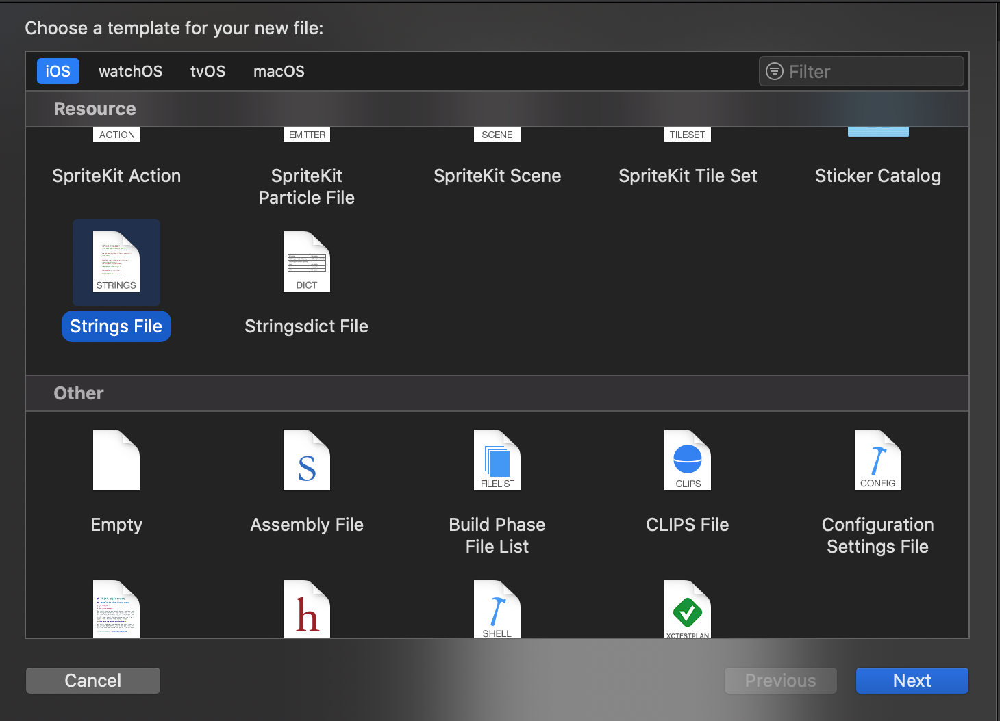
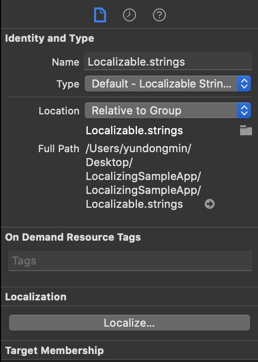
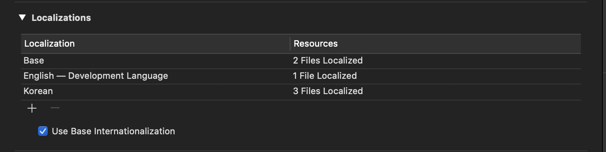

## Localizing (다국어 지원)

***Localizing 이란?*** 

 iPhone 언어의 설정에 맞추어서 앱의 언어를 처리하는 방법이라고 할 수 있다. 이를 활용하면 iPhone 언어에 따라 특정 문구가 변경되는 것을 알 수 있다.

 이를 앱 내에서 지정하기 위해서 **Xcode**로는 `Localizable.strings`을 작성하여 편리하게 Localizing을 사용할 수 있다.

<br>



👉 다음 그림은 Apple 공식 문서에 올라와있는 그림이다. 흝어 보면 **Xcode Project**에 XML 파일을 내보내면 번역을하고 다시 XML 파일을 가져와서 사용한다는 뜻이다.

**<Apple 공식 문서 설명 인용>**

> When you are done internationalizing the app’s user interface and code, begin the localization process. Export all the development language strings files that contain user-facing text to a standard XML Localization Interchange File Format (XLIFF). Submit the XLIFF file to a localization team for translation into multiple languages. Continue developing your app while waiting for the translations. Import the XLIFF translations into the project and test the app in each language you added. Repeat the process as needed, translating just the changes between each app revision. As necessary, perform additional localization steps yourself.

<br>

 즉, 앱의 타겟이 해외로 까지 지정을 하였다면 국제화처리는 당연한 것이다. 이제부터 직접 Localizing 작업을 해볼 것이다.

<br>

✔️ **구현 과정**

1️⃣ String 파일을 추가해준다. 이전에 Swift 파일을 추가하는 것과 동일하게 진행하면 된다.


<br>

2️⃣ 이름은 `Localizable.strings`로 생성한다.

<br>

3️⃣ Inpector Bar의 `Localize...` 버튼을 클릭한다. 이 버튼을 클릭함으로서 이제 Xcode에서 **Localizing** 설정을 준비한다.



<br>

4️⃣ 이제 **Localizing**을 할 준비는 마쳤고, 원하는 언어로의 **Localizing**을 수행할  수 있게 언어를 선택하여야 한다. 프로젝트의 설정에 들어가게 되면 다음과 같은 화면이 나타난 것을 확인할 수있다.

* ➕ 버튼을 누르게 되면 원하는 언어를 추가할 수 있다.



<br>

5️⃣ 이제 **Localizing**을 위한 코드 작성이 필요하다. 단순히 위의 설정만으로 바뀌는 것은 아니다. 여기서 중요한 것은 ***"키" = "값"***의 한 쌍이라는 것이다.

```swift
// ThankYou라는 Key값이 들어왔을 때, 한국어는 감사합니다. 영어는 ThankYou가 출력된다.
"ThankYou" = "감사합니다";
"ThankYou" = "Thank You";
```

<br>

6️⃣ 여기서 이를 위해 좀 더 좋은 코드 작성 법이 있다. `String`의 `Extension`을 활용하는 것이다.

```swift
extension String {
    var localized: String {
        return NSLocalizedString(self, value: self, comment: "")
    }
}
```

<br>

7️⃣ 이제 국제화를 사용하기 위해 다음과 같이 코드를 작성하면 iPhone의 선택한 언어에 따라 적용되는 것을 확인할 수 있다.

```swift
someLabel.text = "ThankYou".localized
```

<br>

---

**참조 문서**

👉 [애플 공식 문서](https://developer.apple.com/library/archive/documentation/MacOSX/Conceptual/BPInternational/LocalizingYourApp/LocalizingYourApp.html#//apple_ref/doc/uid/10000171i-CH5-SW1)