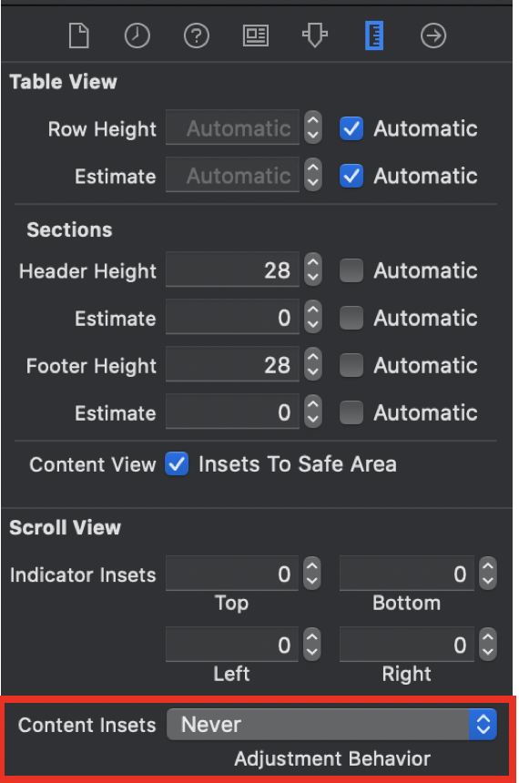
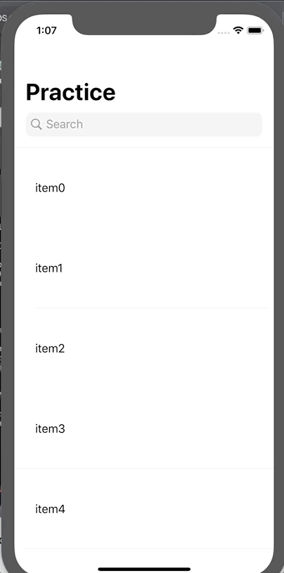

## Navigation Bar 활용

<br>

✅ ***TableView ContentInset 조절하기***

> 다음 그림과 같이 조절하면 SuperView을 기준으로 Content들이 표시된다.



<br>

✅ ***Scroll에 따라 NavigationBar 조절하기***

> NavigationBar의 속성들만 사용하여 다음과 같이 SearchBar와 크기를 조절할 수 있다.



<br>

**소스코드**

```swift
// title 지정
self.navigationItem.title = "Practice"
// Navigation Title을 큰 모드로 보일 수 있게한다.
self.navigationController?.navigationBar.prefersLargeTitles = true
let searchController = UISearchController(searchResultsController: nil)
// NavigationItem의 searchController에 생성한 SearchController을 넣는다.
navigationItem.searchController = searchController
```

