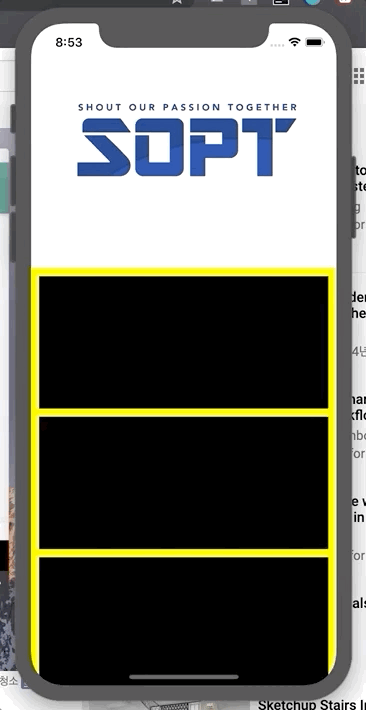
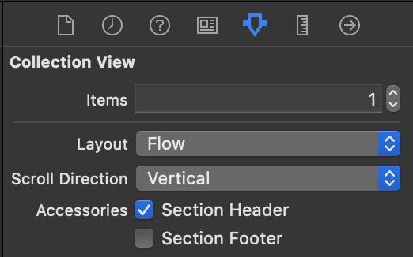

## iOS Stretchy Header

<br>

***실행화면***




***UICollectionViewReusableView 사용 Header 구현***

`ReuableView`을 사용하여 HeaderView에 사용한다.

보통 `ReuableView`는 Header와 Footer에 자주 사용한다. 기본적으로 `CollectionView` 의 설정을 통해 header, footer 체크로 선택한다. 



<br>

<br>

***DataSource 메소드***

기존에 CustomCell을 생성할 때와는 다른 메소드를 사용한다.

> 👉 `collectionView(_ collectionView: UICollectionView, viewForSupplementaryElementOfKind kind: String, at indexPath: IndexPath) -> UICollectionReusableView`

1️⃣ **`collectionView`** : 해당 메소드의 요청이 들어온 CollectionView 객체

2️⃣ **`kind`** : HeaderView로부터 들어왔는지 FooterView로부터 들어왔는지에 대한 정보

```swift
UICollectionView.elementKindSectionHeader 		// HeaderView의 Kind 정보
UICollectionView.elementKindSectionFooter			// FooterView으 Kind 정보
```

3️⃣ **`indexPath`** : collectionView의 위치에 맞는 indexPath ➡️ section, row

<br>

***collectionView 메소드***

> 👉 `dequeueReusableSupplementaryView(ofKind: kind, withReuseIdentifier: HeaderView.identifier, for: indexPath)`

1️⃣ **`ofKind`** : kind로 HeaderView인지 FooterView인지 판단 가능하다.

2️⃣ **`withReuseIdentifier`** : HeaderView에 등록된 identifier 입력

3️⃣ **`indexPath`** : collectionView cell의 위치에 맞는 indexPath

<br>

✅ `UICollectionVIew.contentInsetAdjustmentBehavior` Option

❗️옵션의 조정을 통해 UICollectionView의 Safe Area에 따른 UIEdgeInset을 조정할 수 있다❗️

> 👉 **`always`** 
>
> 👉 **`automatic`**
>
> 👉 **`never`**
>
> 👉 **`scrollableAxes`** 

<br>

<br>

***UICollectionViewFlowLayout 사용***

❗️지금까지의 DataSource, Delegate와 다르게 **Protocol** 타입이 아니다❗️


