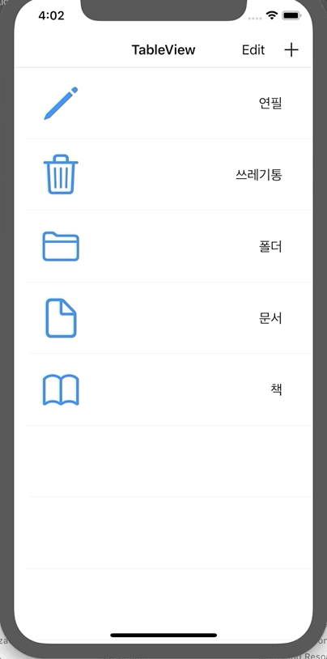

## UIScrollView Refreshing

<br>

***UIRefreshControl 이용 새로고침***

TableView, CollectionView을 밑으로 드래그 후 놓았을 때, 새로고침 되는 기능

<br>

***UIRefreshControl***

 UIScrollView에 기본적으로 붙어있는 객체이다. 즉, UIScrollView을 상속받고 있는 UITableVIew, UICollectionView에도 같이 붙어있는 객체이다. 

 기본적으로 ScrollView을 당겼을 때, 최상단에 보이는 버퍼링 모양이다.

 ❗️ 꼭 refreshAction이 끝났을 때, UIRefreshControl의 `endRefreshing()` 메소드를 호출하여야 한다.

<br>

***UIControl.Event 종류***

👉 touchDown : 컨트롤을 터치했을 때 발생

👉 touchDownRepeat : 컨트롤을 연속 터치할 때 발생하는 이벤트

👉 touchDragInside : 컨트롤 범위 내에서 터치한 영역을 드래그 할 때 발생하는 이벤트

👉 touchDragOutside : 터치 영역이 컨트롤의 바깥쪽에서 드래그 할 때 발생하는 이벤트

👉 touchDragEnter : 터치 영역이 컨트롤의 일정 영역 바깥쪽으로 나갔다가 다시 들어왔을 때 발생하는 이벤트

👉 touchDragExit : 터치 영역이 컨트롤의 일정 영역 바깥쪽으로 나갔을 때 발생하는 이벤트

👉 touchCancel : 터치를 취소하는 이벤트

👉 valueChanged : 터치를 드래그 및 다른 방법으로 조작하여 값이 변경되었을 때 발생하는 이벤트

<br>

1️⃣ `UIRefreshControl` 객체 생성

```swift
class ViewController: UIViewController { 
  private var refreshControl: UIRefreshControl = UIRefreshControl()
}
```

<br>

2️⃣ UIScrollView의 프로퍼티인 `.refreshControl`에 UIRefreshControl 대입

```swift
private func setRefreshButton() {
  // 미리 만들어 놓은 UIRefreshControl 대입
  tableView.refreshControl = refreshControl
}
```

<br>

3️⃣ RefreshControl에 Action 추가

```swift
private func setRefreshButton() {
  tableView.refreshControl = refreshControl
  refreshControl.addTarget(self, action: #selector(refresh), for: .valueChanged)
}

@objc func refreshAction() {
  DispatchQueue.main.asyncAfter(deadline: .now() + 3) {
    // 해당 동작이 수행되고 난 후, 꼭 endRefrehsing을 호출하여야한다.
    // 3초간 Refresh가 실행되고 난 후, 정지
    self.refreshControl.endRefreshing()
  }
}
```

<br>

**실행화면**



