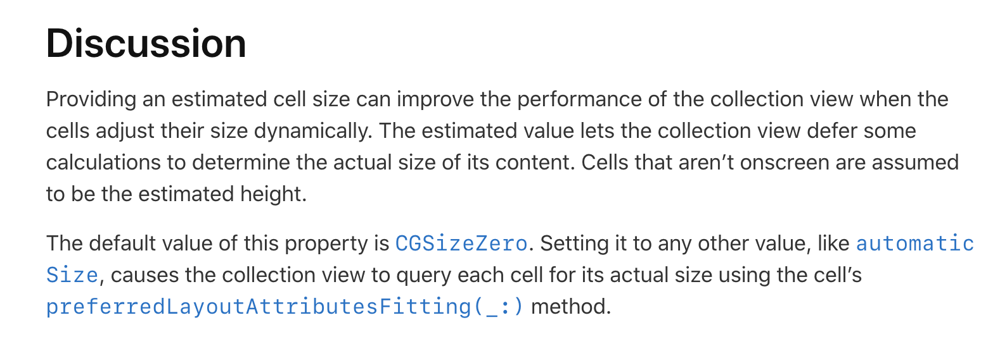
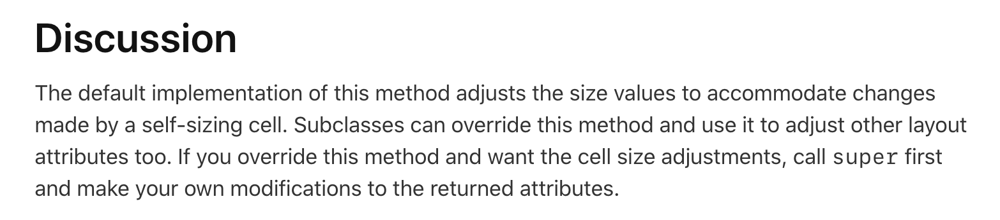

## UICollectionViewCell Dynamic self sizing

<br>

***UICollectionViewCell의 Self sizing이 필요한 경우***

UICollectionView를 사용하다보면 Cell의 내용에 따라 크기를 다르게 해야하는 요구사항이 필요하다. 이 때 사용할 수 있는 방법이다.

보통은 UICollectionView의 Cell의 크기를 결정하기 위해,  `UICollectionViewFlowLayout.itemSize`라는 변수에 원하는 값을 할당한다. 이렇게하면 전부 Cell의 크기가 동일할 때, 동일한 크기로 설정이 가능하다.

그러나 동적으로 사이즈가 할당되어야하는 경우에는 `UICollectionViewFlowLayout.estimatedSize` 변수를 활용할 수 있다. 

애플 개발자 문서를 보면



여기서 중요한 것은 이 사이즈를 지정하게 되면 CollectionView들이 각자의 Cell에게 실제 사이즈를 `preferredLayoutAttributesFitting(_:)` 메소드를 이용해 묻는다는 것이다.

즉, 저 사이즈를 설정하게 되면 CollectionView들을 각각의 셀에게 크기아 어떻게 결정될 건지를 묻게된다. 

<br>

그렇다면 저 `preferredLayoutAttributesFitting(_:)`는 무엇일까?



각 셀의 Layout에 관련된 변수를 리턴해주는 함수이다. 이것을 이용해서 Self-sizing을 위한 작업을 수행해주면 된다.

<br>

---

#### 만들어보기

우선 CollectionView는 storyboard를 이용해서 만들었다고 가정하고,

```swift
class ViewController: UIViewController {
  @IBOutlet weak var collectionView: UICollectionView!
  
  var datas: [String] = ["안녕하세요아아아어ㅏ어아저애정맺엄ㅈ엄ㅈ야ㅐㅓㅁㅈ애ㅑ멎야ㅐ멎애ㅑㅁ저애ㅑㅈㅇ",
                        "저도 안녕하세용자머얌ㅈ어ㅑ",
                        "장아아아아ㅏ아아아자앰자ㅐㅇㅈ마ㅔ애ㅏㅁㅈ",
                        "안녕히가세요................................"]
  
  override func viewDidLoad() {
    super.viewDidLoad()
    if let layout = collectionView.collectionViewLayout as? UICollectionViewFlowLayout {
      layout.estimatedItemSize = CGSize(width: collectionView.bounds.width, height: 200)
    }
  }
}
```

저희는 `preferredLayoutAttributesFitting(_:)` 메소드를 사용할 것이기 때문에, `estimatedItemSize`를 꼭 설정해주어야 합니다. 그렇게해야 `preferredLayoutAttributesFitting(_:)` 함수가 유효하게 작동합니다.

사이즈에는 본인이 원하는 대략의 사이즈를 넣어주면 됩니다.

<br>

다음으로 이제 `CustomCell`이라는 Cell 객체를 만들어주고 스스로 셀의 크기를 설정해줄 수 있는 구현을 해보겠습니다.

```swift
class CustomCell: UICollectionViewCell {
  static let identifier = "customcell"
  
  override func preferredLayoutAttributesFitting(_ layoutAttributes: UICollectionViewLayoutAttributes) -> UICollectionViewLayoutAttributes {
    let attributes = super.preferredLayoutAttributesFitting(layoutAttributes)
    layoutIfNeeded()
    let size = contentView.systemLayoutSizeFitting(CGSize(width: layoutAttributes.frame.width,
                                                              height: 100),
                                                       withHorizontalFittingPriority: .required,
                                                       verticalFittingPriority: .fittingSizeLevel)
    attributes.size.height = size.height
    return attributes
  }
}
```

여기서 중요한 것은 `systemLayoutSizeFitting`이라는 메소드를 활용한다는 점입니다. 저 메소드는 UIView의 객체의 크기를 오토레이아웃을 바탕으로 계산한 결과 적당한 크기를 계산해주는 메소드입니다.

withHorizontalFittingPriority에 .required를 준 이유는 가로의 크기는 제가 지정해준 사이즈로 고정하기 위함이고 verticalFittingPriority에 .fittingSizeLevel은 오토레이아웃을 바탕으로 설정된 크기를 가져오기 위함입니다.

그리고 attributes 속성에 height를 받아온 높이로 바꾸어서 리턴해주면 됩니다.

<br>

저기까지 잘 따라오셨고 contentView을 바탕으로 오토레이아웃을 잘 설정하셨다면 제대로 화면이 나타나는 것을 확인할 수 있습니다.


