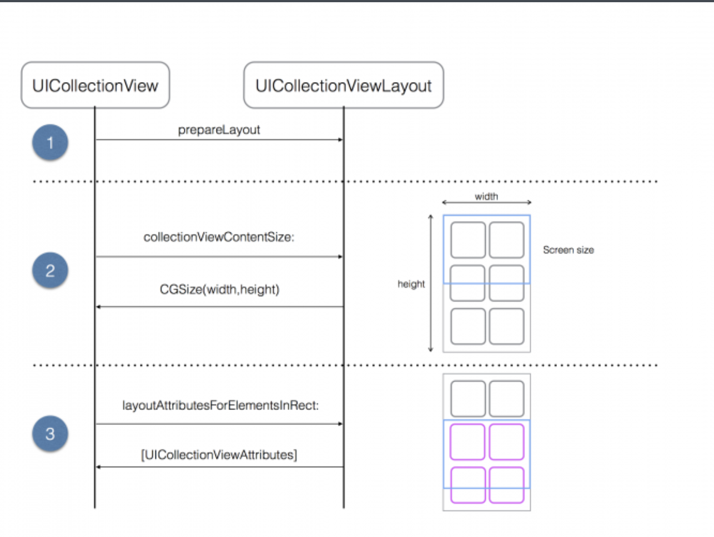

## UIColellectionView Layout

***CollectionView Layout 구조***

 기본적으로 `UICollectionViewFlowLayoutDelegate`을 상속받아서 CollectionView 레이아웃을 조정하는 방법과 `UICollectionViewFlowLayout`을 이용해 조정하는 방법이 있다.

> ✔️ UICollectionViewFlowLayoutDelegate
>
> ✔️ UICollectionViewFlowLayout

<br>

 두 번째 방법에 대해 알아보려고 한다.

 여기서 `UICollectionView.collectionViewLayout`의 속성을 사용하여 Layout을 조정할 수도 있다.

 `UICollectionViewFlowLayout`은 대부분의 프로퍼티의 기본 값을 가지고 있습니다. 하지만 셀의 크기는 (0, 0)으로 기본 값을 가지고 있지 않기 때문에 꼭 지정해주어야 합니다.

```swift
if let layout = customCollectionView.collectionViewLayout as? UICollectionViewFlowLayout {
  layout.itemSize = CGSize(width: 50, height: 50)
}
```

<br>

 직접 각 아이템에 대한 방법을 지정해주는 방법도 있지만, Cell에 AutoLayout을 적용하여 셀 스스로 크기를 결정하게 할 수도 있다. 여기서 Cell의 최소크기를 지정하는 작업이 필요하다.

```swift
if let customCollectionView.collectionViewLayout as? UICollectionViewFlowLayout {
  // 첫번째 방법 모든 셀이 width, heigth 내용에 맞춰 조정되게 하는 방법
  layout.estimatedItemSize = UICollectionViewFlowLayout.automaticSize
  // 두번째 방법 셀의 최소 사이즈를 지정해주고 내용에 맞춰 조정되게 하는 방법
  layout.estimatedItemSize = CGSize(width: 50, height: 50)
}
```

<br>

<br>

***UICollectionViewLayout 메소드들***

 아래의 그림이 CollectionView ↔️ CollectionViewLayout이 상호작용하는 과정이다.



 밑의 메소드들을 override 함으로서 Custom된 CollectionView의 Layout을 구현할 수 있다.

✔️ `prepare()`

> 초기에 CollectionView의 레이아웃을 설정할 때 호출된다. 즉 사이즈를 위한 어떤 셋팅이 필요할 때, 이 메소드를 override을 함으로서 구현할 수 있다.

✔️ `layoutAttributesForElements(rect:) -> [UICollectionViewLayoutAttributes]?`

> CollectionView안의 모든 요소에 대한 Layout 요소들을 리턴한다.

✔️ `shouldInvalidateLayout(newBounds:) -> Bool`

> Layout에 변화가 있을 때마다, 함수를 호출할지 결정한다. default 값은 false이다. true로 설정하면 계속해서 호출한다.

✔️ `layoutAttributesForItem(indexPath:) -> UICollectionViewLayoutAttributes?`

> CollectionView안의 특정 indexPath 아이템에 대해 attribute을 요구해서 리턴한다.

