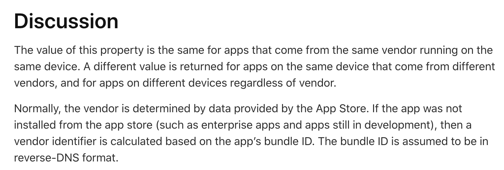

## iOS UUID vs UDID

 우선 **UUID**와 **UDID**을 비교하기 전에 먼저 둘이 각각 무엇을 의미하는지 알아야 할 것 같습니다. 먼저 뜻에 대해 알고 넘어가겠습니다.

 

***UUID란?***

> **U**niversally **U**nique **ID**entifier의 약어입니다. 즉 범용적으로 사용할 수 있는 고유 식별자라고 알면 될 것 같습니다. 고유하게 식별하기 위해 사용한다고 아시면 될 것 같습니다.

 

***UDID란?***

> **U**nique **D**evice **ID**entifier의 약어입니다. 즉 어떤 기기의 고유 번호라고 이해하면 될 것 같습니다. 각 핸드폰에 부여된 고유한 ID 값 입니다.

 

 이렇듯 두 개의 뜻을 보면 각각 고유한 Identifier라고 알 수 있습니다. 그러나 여기서 다른 점이 무엇이냐고 하면 **UDID**는 단말기의 고유 번호라는 점이고 **UUID**는 앱마다 생성해서 사용하는 고유 식별자입니다.

 여기서 문제가 되는 지점은 **UDID**가 단말기 번호라는 점에서 개인정보 문제가 발생할 수 있다는 것입니다.

 Apple에서는 **iOS 5.0**이상의 버전부터는 **UDID**을 불러오는 메소드의 사용을 `deprecated`하게 만들었습니다. 즉 이후 버전 타겟부터는 **UUID**을 사용하도록 권고하고 있습니다.

 

---

🔴 **문제점**

 여기서 생기는 문제는 **UUID**는 임의로 생성하는 값이기 때문에 앱을 삭제하고 깔게되면 새롭게 생성되기 때문에 고유 값이 아니라는 것이다. 

 이를 해결하기 위해 APPLE에서 대응 방안을 마련해주었다. `identifierForVendor`이라는 메소드이다. 앱에 고유하게 어떤 공급업체 즉, Organization, bundle Identifier에 따라 **UUID** 값을 지정해준다는 것이다.

 

개발자 공식 문서의 해석을 확인해보면 다음과 같다. 

> **직독직해** : 이 값은 어떤 앱의 같은 공급자로부터 생성되는 어떤 앱에 대해 주어진다는 것이다. 즉, 다른 값은 같은 장치의 다른 앱의 경우, 다른 장치의 경우에는 다른 UUID 값이 주어진다. 즉, 고유한 ID를 가진다고 알면 될 것 같다.
>
>  이 역시도 앱을 삭제했다가 다시 받게 되면 다른 값을 받는 것 같다. 이를 위해서 **KeyChain**을 사용해서 핸드폰에 저장하는 방법이 있다. 이는 공정초기화를 하지 않는 경우 유지된다.

 

---

✔️ **해결 방안 - KeyChain 사용**

 KeyChain을 사용하면 핸드폰이 공정초기화가 되기 전까지 핸드폰 내에서 중요한 정보들을 저장할 수 있습니다. 이를 위해, 간단하게 사용할 수 있는 라이브러리가 있어 사용해보았습니다.

👉 `SwiftKeyChainWrapper`