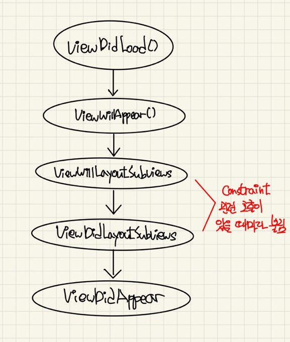

## View Layout 호출시기

***View의 Layout 결정 순서***

 iOS에서 뷰의 위치를 지정할 때, Auto Layout을 지정하여 뷰를 지정하게 된다. 여기서 Auto Layout이 지정된대로 호출되고 결정될 때에도 순서가 있다.

> 1️⃣ `viewWillLayoutSubviews()`을 호출한다. 여기 메소드를 이용해서 Layout이 결정되기 전에 조정을 할 수 있다.
>
> 2️⃣ ViewController에서 SubView들이 `layoutSubviews()` 메소드를 호출한다. 여기서 현재 모든 SubView들을 순회하면서 `layoutSubviews()`을 호출한다.
>
> 3️⃣ 레이아웃이 적용되고 `viewDidLayoutSubviews()`가 호출된다. 즉 Layout이 적용된 이후 정보를 바꿀 수 있다.

 

 여기서 View의 생성주기와 관련해서 함수들이 어떤 순서로 호출되는지 궁금해서 실행을 시켜보았다. 다음과 같은 순서로 진행되었다.

✔️ 여기서 `ViewWillLayoutSubviews`, `ViewDidLayoutSubviews()` 메소드는 한 번만 불리는 것이 아니라 Constraint관련 재설정이 있을 때마다 지속적으로 불리는 것을 알 수 있었다.

> ***Constraint 관련 변화 때마다 호출되기 때문에 서로 다른 용도로 사용할 수 있다.***

 

***ViewWillLayoutSubviews()***

👉 Layout이 결정되기 전, 어떤 작업을 수행하고자 할 때 ViewController에서 override하여 사용할 수 있다.

1️⃣ View을 추가하거나 제거할 때

2️⃣ 뷰의 크기나 위치를 바꾸어줄 때

3️⃣ Constraint을 바꾸어줄 때

 

***ViewDidLayoutSubviews()***

👉 Layout이 결정된 후, 어떤 작업을 수행하고자 할 때 ViewController에서 override하여 사용할 수 있다.

1️⃣ 데이터를 Layout에 맞게 load해올 때

2️⃣ 어떤 뷰들의 내용을 업데이트 할 때

3️⃣ 뷰의 크기나 위치를 상대적으로 Contraint을 걸어 결정할 때

📌 주로 Button의 CornerRadius을 적용할 때, ViewDidLoad의 함수에서 작성하는 것이 아닌 이 함수에서 적용하면 Button의 Radius가 원하는만큼 적용되는 것을 알 수 있다. Bounds가 결정되고 불리기 때문이다.

