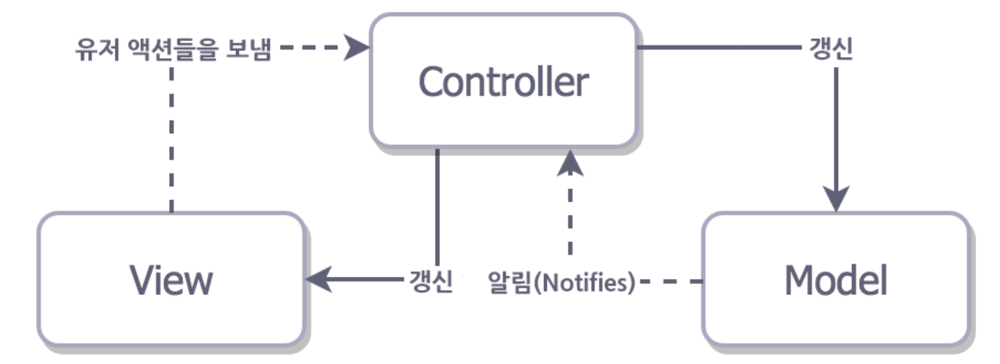

## iOS Design Pattern

 

***Design Pattern 이란?***

소프트웨어를 설계할 때 특정 상황에서 자주 사용하는 패턴을 정형화한 것이며, 좋은 소프트웨어 설계를 위한, 개발자들의 경험적 산물이라고 할 수 있다.

 

대표적 패턴

👉 **MVC(Model - View - Controller)**

👉 **MVVM(Mode - View - View Model)**

👉 **MVP(Model - Passive View - Presenter)**

 

 

### MVC Pattern

 

**MVC Pattern**이란 Model - View - Controller을 일컫는 말이다.  

`Model` : 데이터에 관한 로직을 담는 부분이다.

`View` : 사용자에게 보여지는 화면을 말한다.

`Controller` : View에 입력된 값을 Model로 전달하는 역할, Model에서 처리된 값을 View에 전달하여 화면을 갱신하는 역할 ➡️ 가운데에서 이를 제어하는 역할

 

MVC 패턴

 Apple에서는 기본적으로 iOS을 개발할 때 MVC 패턴을 권장한다. 각 영역이 나누어져 있는 만큼 서로에게 접근하면 안된다. 

 여기서 보통 ***Controller***는 ***View***와 ***Model***에 접근을 하게 된다. 그러나 반대로의 접근은 패턴의 형식을 깨게 된다. 그렇기 때문에, 보통 ***Model***에서 값이 바뀔 경우 Notify을 통해 ***Controller***에게 알리고 ***Controller***는 ***Model***에 접근한다.

 다르게 ***View***에서 입력이 들어왔을 때는 Delegate을 통해 ***Controller***에게 이 역할을 위임해 ***Controller***에서 해당 로직을 처리할 수 있게 해준다.

 

🔵 **장점** : 역할 분담을 통해 구조를 빠르게 구현할 수 있다. 즉, 생산성이 좋다.

🔵 **단점** : Controller가 중앙에서 모든 것을 컨트롤하는 만큼 Controller의 역할이 지나치게 많아진다. 즉, 모든 코드들이 Controller에 집중되게 된다.

 