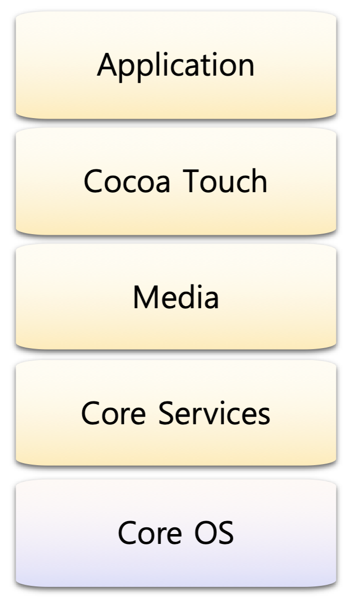

## iOS 구성

 

 

**iOS Layer Structure**

아이폰, 아이패드에 사용되는 iOS의 계층 구조에 대해 알아본다.

> Cocoa Touch Framework을 구성하는 작은 단위의 프레임워크들은 계층 관계를 이룬다!!

 

***프레임워크란?***

소프트웨어의 구체적인 부분에 해당하는 설계와 구현을 재사용이 가능하게끔 일련의 협업화된 형태로 클래스들을 제공하는 것.

 

***Cocoa Touch Framework란?***

iOS 개발환경의 터치 기반의 어플리케이션을 제작하기 위한 도구들의 모음이다. 

[Cocoa Touch Framework]

1. `Cocoa Touch` 

   👉 화면의 그래픽 UI 및 터치의 기능을 제공

   👉 UIKit(UI구성, 터치), MapKit(지도), MessageUI(메세지, 이메일) 등의 기능 포함

2. `Media` 

   👉 그래픽이나 오디오, 비디오 등 멀티미디어 기능을 제공

   👉 AvFoundation(미디어 재생관련), MediaPlayer(플레이어), Core Animation, Core Graphics등의 기능 포함

3. `Core Service`

   👉 시스템의 핵심 기능을 관리한 Core OS에서 제공하지 않는 부가기능들을 포함

   👉 GPS 나침반, 가속도 센서나 자이로스코프 센서와 같이 디바이스의 하드웨어 특성에 기반한 서비스 제공.

   👉 Foundation, Core Location, Core Animation, Core Motion

4. `Core OS 계층`

   👉 하드웨어와 가장 가까이 있는 최하위 계층

   👉 C기반의 저수준의 API로 이루어져 있음

   👉 커널, 파일 시스템, 전원 관리, 디바이스 드라이버 등이 포함 (iOS가 운영 체제로서 기능을 하기 위한 핵심적인 영역)
