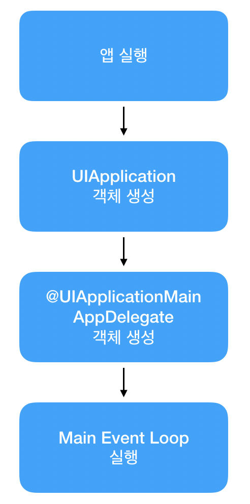

## iOS 앱 실행 순서

 

### 앱 실행 프로세스

1. 앱 실행
2. ***UIApplication*** 객체 생성 (싱글톤 객체 - 앱에 하나만 존재)
3. ***@UIApplicationMain*** 어노테이션이 있는 클래스를 찾아 ***AppDelegate*** 객체를 생성
4. Main Event Loop 실행

 

### 각 객체 역할

1. ***UIApplication***

👉 싱글톤 패턴으로 앱에 단 하나의 인스턴스만 존재

👉 앱의 Event Loop을 관리한다.

👉 AppDelegate에 App 상태변화, 푸시 알림 등 주요 event을 전달한다.

2. ***AppDelegate***

👉 앱이 처음 실행될 때, `AppDelegate.swift` 파일이 AppDelegate 객체가 된다.

👉 싱글톤 패턴으로 앱에 단 하나의 인스턴스만 존재한다.

👉 `UIApplication` 객체로부터 메세지를 받았을 때, 해당 상황에서 실행될 함수들을 정의한다.

👉 `UIApplicationDelegate Protocol`을 구현하여 app의 상태 변화마다 호출되는 method에 custom code을 작성하여 실행시킬 수 있다.

