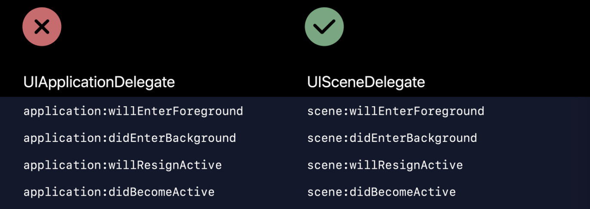

## SceneDelegate.swift 

***iOS 13.0 이후 버전부터는 SceneDelegate.swift가 추가***

 iOS 12.0 이전 부터는 하나의 앱에 하나의 `window`가 사용되었다. 하지만 iOS 13.0 이후부터는 window의 개념이 `scene`으로 대체되고 하나의 앱에 여러개의 `scene`을 가질 수 있다.

👉 ***AppDelegate*** 의 역할 중 UI의 상태를 알 수 있는 UILifeCycle 부분을 ***SceneDelegate***가 대체하게 되었다.

> 즉, 기존에 ***AppDelegate*** 의 프로퍼티이던 `window`의 개념이 `scene`으로 대체되었다.

 

***Scene이란?***

 UIKit UIWindowScene 객체를 사용하는 앱 UI의 각 인스턴스를 관리한다. 즉, `Scene`에는 UI의 하나의 인스턴스를 나타내는 `windows`와 `view controllers`가 들어있다. `Scene`들은 같은 메모리와 프로세스 공간을 공유하면서 동시에 실행된다. 결과적으로 하나의 앱에 여러개의 `Scene`이 존재할 수 있다.

 

✔️ ***AppDelegate***에서는`Scene Session`을 사용해서 `scene`에 대한 정보를 업데이트 받는다.

 

***Scene Session이란?***

 UISceneSession 객체는 scene의 고유의 런타임 인스턴스를 관리한다. 새로운 Scene을 추가하면 시스템은 새로운 session 객체를 추가한다. 그 Session에는 ***고유 식별자***와 ***구성 세부사항***이 들어있다.

 

***분리되면서 AppDelegate가 하는 일은?***

 이전에는 foreground, background 사이를 이동할 때, 앱의 상태를 업데이트하는 등의 생명 주기 이벤트를 관리했지만 더 이상 하지 않는다.

> 👉 앱의 가장 중요한 데이터 구조를 초기화하는 것
>
> 👉 앱의 Scene을 환경설정 하는 것
>
> 👉 앱 밖에서 발생한 알림(배터리 부족, 다운로드 완료 등)에 대응하는 것
>
> 👉 애플 푸쉬 알림 실행시 요구되는 모든 서비스 등록하는 것

 

***AppDelegate만 사용해서 이전과 같이 사용하기***

1️⃣ `SceneDelegate.swift` 파일 삭제

2️⃣ ***AppDelegate***에 추가된 `UISceneSession` 관련된 두 메소드 삭제

3️⃣ ***SceneDelegate***로 옮겨진 `window` 프로퍼티 ***AppDelegate***로 다시 옮기기

4️⃣ `Info.plist`에서 Scene과 관련된 Manifest인 Application Scene Manifest 삭제