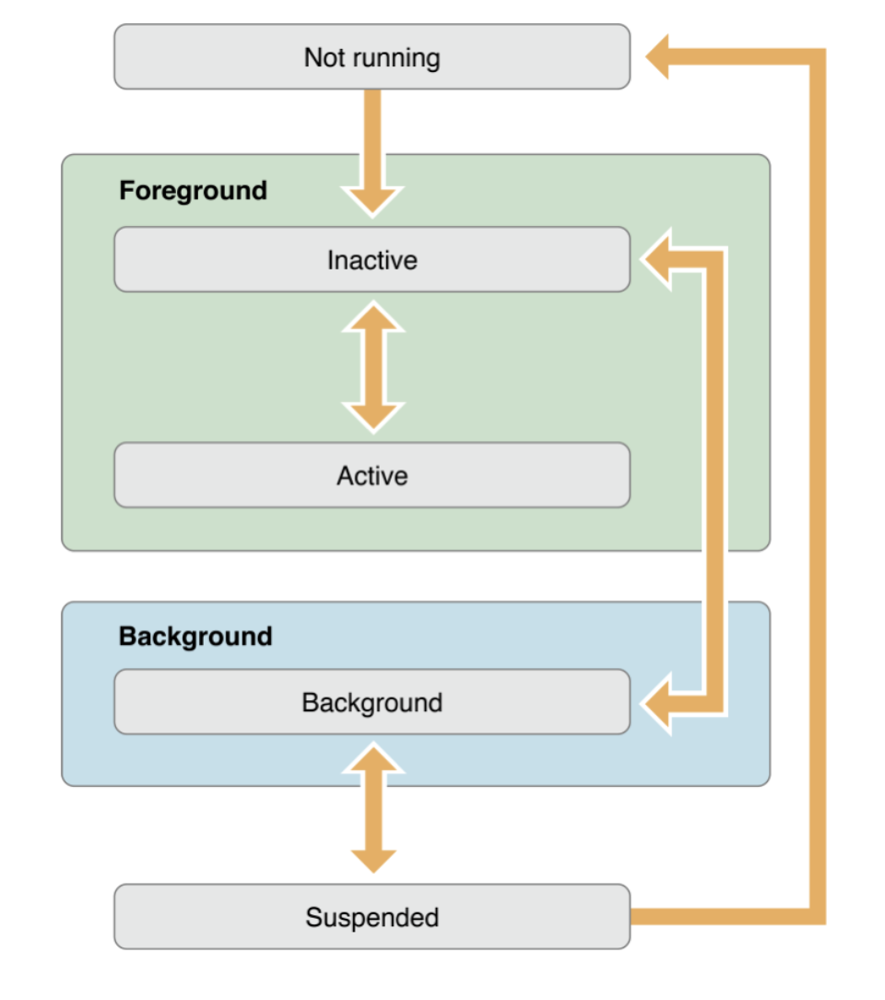
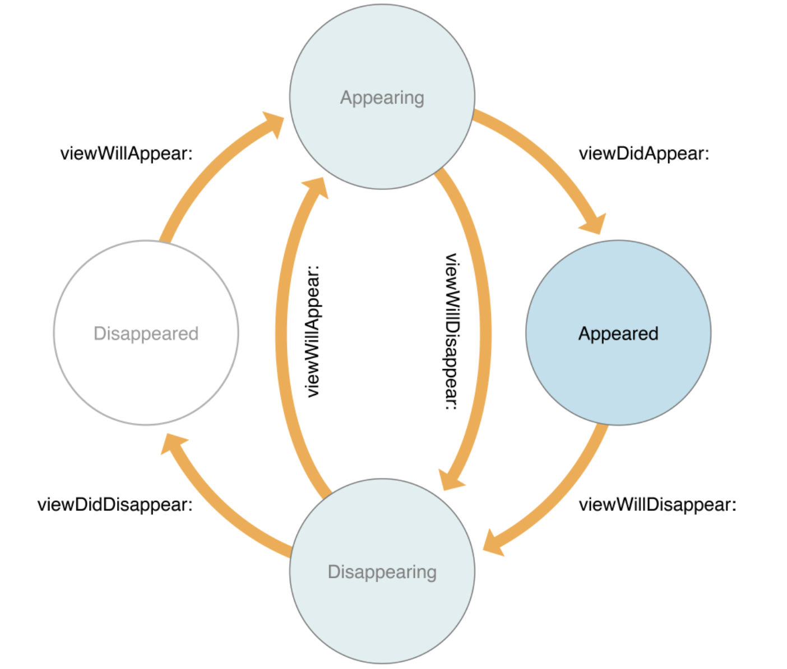

## App Life Cycle, ViewController Cycle

### 앱 생명주기 (App Life Cycle)

`AppDelegate.swift` 파일에 앱의 상태에 따라 실행되는 함수들이 정의되어 있다.

App State</App>

🔵 Not Running : 앱이 실행되지 않는 상태

🔵 Inactive : 앱이 실행중인 상태 그러나 아무런 이벤트를 받지 않는 상태

🔵 Active : 앱이 실행중이며 이벤트가 발생한 상태

🔵 Background : 앱이 백그라운드에 있는 상태 그러나 실행되는 코드가 있는 상태 (Ex. 백그라운드에서 음악을 실행하거나, 걸어온 길을 트래킹하는 등)

🔵 Suspend : 앱이 백그라운드에 있고 실행되는 코드가 없는 상태, 빠른 재실행을 위하여 메모리에 적재된 상태지만 실질적으로 동작하고 있지는 않다.

 

###AppDelegate.swift

앱 상태별 AppDelegate 함수

1. `application(_:didFinishLaunchingWithOptions)` - 앱이 실행된 직후 사용자의 화면에 보여지기 직전에 호출
2. `applicationWillResignActive` - 앱이 active에서 inactive로 이동될 때 실행
3. `applicationDidEnterBackground` - 앱이 backgroud 상태일 때 실행
4. `applicationWillEnterForeground` - 앱이 background에서 foreground로 이동될 때 실행
5. `applicationDidBecomeActive` - 앱이 active상태가 되어 실행 중일 때
6. `applicationWillTerminate` - 앱이 종료될 때, 실행

### 생명 주기 (ViewController Life Cycle)

`ViewController.swift` 파일에 ViewController의 생명주기에 따라 실행되는 함수들이 정의되어 있다.

Life Cycle

1. `viewDidLoad` - 해당 ViewController 클래스가 생성될 때 실행
2. `viewWillAppear` - ViewController가 화면에 나타나려 할 때 실행, 즉 ViewController가 화면에  띄어질 때마다 꼭 실행됨
3. `viewDidAppear` - ViewController가 화면에 나타난 직후에 실행
4. `viewWillDisappear` - ViewController가 화면에서 사라지기 시작할 때 실행
5. `viewDidDisappear` - ViewController가 사라진 후 실행