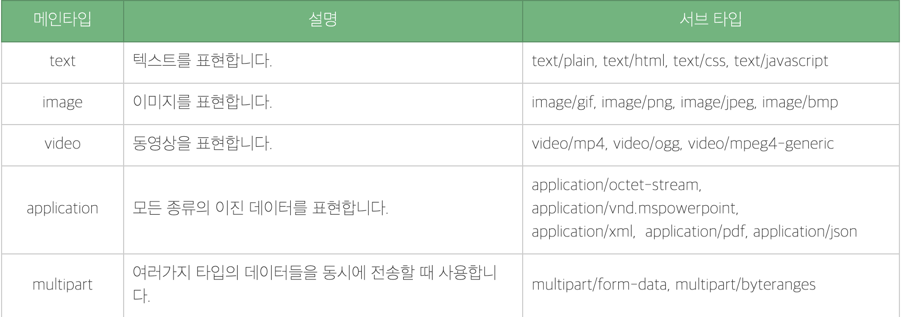

## 이미지 업로드 & 다운로드

***URLSession Download Task 이용해서 이미지 다운로드***

✔️ 캐시에 있는 경우 다운로드 하지 않음 & 캐시에 없는 경우 다운로드 실행

 DownloadTask을 이용해서 다운로드를 받을 때, 완료 후 일시적인 공간에 해당 파일이 저장되게 된다. 이를 보관하기를 원한다면 꼭 Handler가 끝나기 전에 다른 공간에 저장해야한다.

 여기서 Download을 받는 동안 진행과정에 대한 업데이트를 받기를 원하면 꼭 `URLSessionTaskDelegate`, `URLSessionDownloadDelegate`을 사용하여야 한다.

 우선 URLSession에 대한 생성이 필요하다.

```swift
class FriendViewController: UIViewController {
  // Delegate 지정을 위해 Lazy로 선언
  lazy var downloadSession: URLSession = {
        let configutaion = URLSessionConfiguration.default
        return URLSession(configuration: configutaion, delegate: self, delegateQueue: nil)
    }()
}

extension FriendViewController: URLSessionTaskDelegate, URLSessionDownloadDelegate {
  // Donwload Task가 완료된 후에 불리는 메소드
  func urlSession(_ session: URLSession, downloadTask: URLSessionDownloadTask, didFinishDownloadingTo location: URL) {
    print(location.absoluteURL)
  }
  
  // Download Task가 진행되는 동안 진행상황을 나타내는 메소드
  func urlSession(_ session: URLSession, downloadTask: URLSessionDownloadTask, didWriteData bytesWritten: Int64, totalBytesWritten: Int64, totalBytesExpectedToWrite: Int64) {
    let calculatedProgress = Float(totalBytesWritten) / Float(totalBytesExpectedToWrite)
    print(calculatedProgress)
  }
}
```

<br>

기본적인 URLSession을 생성하고 셋팅한 방법이다. 이후 Request 방식을 설정하고 통신을 하는 과정이 필요하다.

1️⃣ URLSession

> 통신을 하는 큰 방법이다. 3가지를 지원한다.

2️⃣ URLRequest

> 서버로 요청을 보낼 때,어떤 방식으로 보낼지 어떤 HTTP 메소드를 사용할 것인지 어떤 내용을 보낼지를 설정할 수 있는 객체이다.

3️⃣ Task

> 객체가 서버로 요청을 보낸 후, 응답을 받을 때 URL 기반의 내용들을 받는 역할을 합니다. 3가지 종류의 Task가 지원된다.
>
> 👉 Data Task
>
> 👉 Download Task
>
> 👉 Upload Task

<br>

✔️ URLRequest 세팅하는 법

```swift
// HTTP Method는 POST 방식으로 통신
// Header Type은 JSON 형식으로 주고 받음
let url = URL(string: "https://example.com/post")!
var request = URLRequest(url: url)
request.httpMethod = "POST"
request.setValue("application/json", forHTTPHeaderField: "Content-Type")
```

<br>

 다운로드를 처리해 줄, DownloadService 객체를 생성 후, URLSession의 DownloadTask을 활용해 구현하였다. 기본적으로 DownloadTask을 활용해 다운이 받아지는 파일들의 위치를 보면 tmp에 다운이 되는 것을 확인할 수 있다. 이를 Cache로 저장을 하고 Cache에 있을 시 DownloadTask을 사용하는 것이 아닌 Cache에서 불러와서 효율적으로 처리를 하려고 한다.

```swift
struct DownloadService {
  static let shared = DownloadService()
  
  // completion에는 각 Controller에서 사용되는 로직을 구현해서 던져준 후, Task가 실행되고난 후 실행되게 함.
  func download(from url: String, session: URLSession, completion: @escaping (NetworkResult<Any>) -> Void) {
    guard let url = URL(string: url) else { return }
    let request = URLRequest(url: url)
    var cachePath = FileManager.default.urls(for: .cachesDirectory, in: .userDomainMask).first
    cachePath?.appendPathComponent(url.lastPathComponent)
    
    let downloadTask = session.downloadTask(with: reqeust) { 
      location, response, error in
      // 더 하위 개념인 HTTPResponse로 캐스팅하여 statusCode 확인하여 분기처리  
      guard let response = response as? HTTPURLResponse else { return }
      switch response.statusCode {
        // 성공적으로 데이터를 다운받아온 경우 tmp --> cache 폴더로 복사하기
        case 200:
        try? FileManager.default.copyItem(at: location!, to: cachePath!)
        complection(.success(cachePath))
        case 400: complection(.pathErr)
        case 500: complection(.serverErr)
        default: complection(.networkFail)
      }
      
      // Cache에 있는 경우는 cache에 있는 파일 사용
      // Cache에 없는 경우는 Download Task 실행
      if !FileManager.default.fileExists(atPath: cachePath!.absoluteString) { downloadTask.resume() }
      else { completion(.success(cachePath!)) }
		}
  }
}
```

<br>

<br>

***KINGFISHER 이용해서 이미지 다운로드***

 기본적으로 **KINGFISHER** 라이브러리를 사용해서 이미지를 다운로드하기 위해 Cocoapods을 사용해 **KINGFISHER** 라이브러리 설치가 필수이다. 여기서는 5.0 version을 사용하였다.

```swift
// 사용하기 이전에 필수이다.
import Kingfisher
```

<br>

 우선 캐시에 이미지가 있는지 없는지 판별해서 이미지를 받아오는 것이 효율적이다.

✔️ 캐시 확인 법

```swift
let cache = ImageCache.default
// 해당 Key에 데이터가 있는지 확인 후 Bool 타입을 반환한다.
let cached = cache.isCached(forKey: cacheKey)
// .memory
// .disk
// .none
// 세 가지 타입이 필요하다
let cacheType = cache.imageCachedType(forKey: cacheKey)
```

<br>

 위까지의 방법이 캐시에 있는 데이터를 확인하는 방법이다. 이제 캐시에 데이터가 있는지 없는지 검사 후, 이를 가져오거나 캐시에 없는 경우, 다운로드를 해주는 작업이 필요하다. 

✔️ 캐시에 있고 없는 경우 분기 처리

```swift
let cache = ImageCache.default
// 캐시에서 해당 키에 데이터가 있는 경우 .success 실행
// 캐시에서 해당 키에 데이터가 없는 경우 .failure 실행
cache.retrieveImage(forKey: "cacheKey") { 
  result in
  switch result {
    case .success(let value):
    case .failure(let error):
  }
}
```

<br>

 캐시에 데이터가 있는지 없는지 검사해서 Image에 세팅할지를 정하는 코드이다.

✔️ 전체 활용법

```swift
extension UIImageView {
  func setImage(from url: String) {
    let cache = ImageCache.default
    // 이미지를 받아오는 동안 indicator 실행
    self.kf.indicatorType = .activity
    // 캐시에 이미지가 있는지 없는지 검사하여 분기 실행
    cache.retrieveImage(forKey: url) { 
      result in
      switch result {
      case .success(let value):
        	switch value.cacheType {
          // 캐시에 이미지가 저장되지 않은 경우 데이터를 받아옴
          // setImage을 실행할 경우 알아서 AbsoluteURL을 보고 캐시에 해당 키로 저장한다.
          case .none: self.kf.setImage(with: URL(string: url)!, placeholder: UIImage(systemName: "pencil"), options: [.transition(.fade(1))])
          case .memory: self.image = value.image
          case .disk: self.image = value.image
          }
      case .failure(let error):
        	print(error.errorCode)
        	self.image = UIImage()
      }
    }
  }
}
```

<br>

<br>

***Multipart-form Data 사용 이미지 업로드***

 우선 기본적으로 클라이언트에서 서버로 파일을 보내려면 multipart/form-data 타입으로 파일을 전송하여야 합니다. 이때 보통 헤더로 Content-Type에 application/json 형식이 들어가는 것이 아닌 multipart/form-data가 들어가게 됩니다. 

 즉, 데이터를 Body에 넣어 보낼 때 폼 데이터가 여러 부분으로 나뉘어서 서버로 전송하는 것을 의미한다. 이렇게 보내기 때문에 2종류 이상의 데이터를 구분해서 넣는 것이 가능하다.

> ✔️ Content-Type : multipart/form-data
>
> 모든 문자를 인코딩하지 않음을 명시함. 이 방식은 <form> 요소가 파일이나 이미지를 서버로 전송할 때 주로 사용한다.
>
> multipart/form-data는 폼데이터가 여러 부분으로 나뉘어 서버로 전송되는 것을 의미한다.
>
> 즉, 형태를 보게 되면 리스트 형식으로 되어 있어서 한 파일, 파일을 나누어서 붙여야한다.

<br>

 Alamofire의 uploadTask의 multipartform 데이터를 보낼 수 있는 형식이 구현되어 있는 것을 사용하여 서버와 통신하였다. 우선 통신을 위해 해야할 작업들이 있다.

👉 Alamofire 4.8version 사용

👉 API 구성 완료

1️⃣ 서버 통신을 위한 URL 주소 저장

2️⃣ 통신을 통해 받을 Response 객체 생성

3️⃣ Alamofire 사용 Upload 메소드 작성

<br>

✔️ 서버 통신을 위한 URL 주소 저장

```swift
struct APIConstants {
  static let baseURL = "http://13.209.144.115:3002"
  static let profileURL = APIConstants.baseURL + "/user/profile"
}
```

<br>

✔️ 통신을 통해 받을 Response 객체 생성

```swift
// API문서를 참고해서 Request 객체를 만들어주어야 한다.
// Profile 작업을 위해 받은 API 문서를 기준으로 작성하였다.
struct ProfileData: Codable {
  var status: Int
  var success: Bool
  var message: String
  var data: [UserProfile]?
  
  enum CodingKeys: String, CodingKey {
    case status = "status"
    case success = "success"
    case message = "message"
    case data = "data"
  }
  
  // CodingKey 프로토콜을 이용해 Key값이 들어오지 않은 경우를 처리해주었다
  init(from decoder: Decoder) throws {
    let values = try decoder.container(keyedBy: CodingKeys.self)
    status = (try? values.decode(Int.self, forKey: .status)) ?? -1
    success = (try? values.decode(Bool.self, forKey: .success)) ?? false
    message = (try? values.decode(String.self, forKey: .message)) ?? ""
    data = (try? values.decode([UserProfile].self, forKey: .data)) ?? nil
  }
}

struct UserProfile: Codable {
  var name: String
  var email: String
  var phone: String
  var profile: String
}
```

<br>

✔️ Alamofire 사용 Upload 메소드 작성

```swift
func uploadImage(_ token: String, completion @escaping (NetworkResult<Any>) -> Void) {
  // Content Type ==> multipart/form-data 생성
  let headers: HTTPHeaders = [
    "Content-Type" : "multipart/form-data",
    "jwt" : token
  ]
  
  Alamofire.upload(multipartFormData: { 
    multipartFormData in
    let logoImageData = UIImage(named: "mainLogo")!.jpegData(compressionQuality: 1.0)!
    multipartFormData.append(logoImageData, withName: "profile", fileName: "파일이름", mimeType: "image/jpeg")
  }, usingThreshold: UInt64.init(), to: APIConstants.profileURL, method: .post, headers: headers, encodingCompletion: { 
    (result) in
    switch result {
      case .success(let upload, _, _):
      	// Upload가 진행되는 과정을 백분율로 표현하기 위한 코드
      	upload.uploadProgress(closure: { 
          (progress) in
          print(progress.fracgtionCompleted)
        })
      	
      	upload.responseData { 
          response in
          print(response.result.value)
        }
      case .failure(let error): print(error.localizedDescription)
    }
  
  })
}
```

> **withName** : Multipart Form 데이터를 보낼 때, 지정할 Key값을 넣어준다. 
>
> **fileName** : 데이터를 보낼 Body와는 관련없이 보내는 파일의 이름을 지정할 수 있다.
>
> **mimeType** : 데이터를 보낼 때, 변환 시 사용할 데이터 형식을 정의한다.
>
> 👉 ***MIME이란?*** 원래는 E-mail에 사용하기 위해 등장했지만 지금은 HTTP 통신에서 전송 데이터를 표현하기 위해서도 사용하고 있다. 메세지의 종류를 나타내는 Content-Type과 같은 추가적인 E-mail 헤더를 정의하는 것이다. 
>
>  밑의 그림을 보면 각 헤더로 표시하는 데이터의 형식이 나와있다. 여기서 전송 시 중간단계에서 해당 타입을 통해 어떤 파일로 변화할지 알 수 있고 이를 변환해서 사용한다.
>
> 
>
> **usingThreshold** : ??
>
> **encodingCompletion** : MultipartForm 데이터로 인코딩이 끝난 뒤에 실행되는 코드이다.

