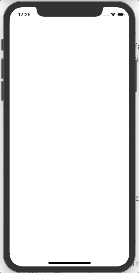

## 카운트 다운 커스텀 뷰 만들기

<br>

***카운트 다운 커스텀 뷰 만들기***

`CABasicAnimation`, `CAShapeLayer`을 이용해 프로그레스 바를 둥글게 만들고 주변에 Pulse 이펙트 효과를 추가하였다.

<br>

* **CABasicAnimation** : 보통 UIView의 경우 애니메이션을 위해 UIView.animate를 사용한다. 그러나 Layer를 위해서 이 클래스를 사용해서 애니메이션 효과를 제공할 수 있다.

  `keyPath`을 이용해서 선언하고 `fromValue`, `toValue`를 이용해서 애니메이션 값들을 조절할 수 있다.

  ```swift
  let animation = CABasicAnimation(keytPath: "opacity")
  animation.fromValue = 0
  animation.toValue = 1
  
  let animation2 = CABasicAnimation(keyPath: "backgroundColor")
  animation2.fromValue = NSColor.red.cgColor
  animation2.toValue = NSColor.blue.cgColor
  
  let animation3 = CABasicAnimation(keyPath: "transform.scale")
  animation3.fromValue = 1
  animation3.toValue = 2
  ```

* **CAShapeLayer** : `UIBazierPath`로도 UIView의 `draw(_:)`에서 그릴 수 있지만 CAShapeLayer을 이용하는 이유는 Core Animation 안에 속해있어서 그래픽적인 역할을 더 수행할 수 있는(?) 그런 것 같습니다..!

  ```swift
  let path = UIBezierPath()
  path.move(to: self.frame.origin)
  path.addLine(to: CGPoint(x: self.frame.width,
                           y: self.frame.height))
  
  let shapeLayer = CAShapeLayer()
  shapeLayer.path = path.cgPath
  shapeLayer.storkeColor = UIColor.red.cgColor
  shapeLayer.fillColor = UIColor.yellow.cgColor
  ```


이렇게 두 가지 클래스를 이용해서 커스텀으로 카운트다운을 하는 뷰를 만들어줄 것입니다.

우선 배경으로 쓸 카운트 다운 될 때, 전체 진행 상황을 보여주는 Layer와 진행 상황을 나타내는 Layer, Pulse 효과를 보여주는 Layer을 먼저 만들어 줄게요. 그리고 카운트 다운 상황을 보여주는 Label을 생성해줄게요.

```swift
private lazy var remainingTimeLabel: UILabel = {
  let label = UILabel()
  label.font = UIFont.boldSystemFont(ofSize: 30)
  label.textAlignment = .center
  return label
}()

// 프로그레스 진행 상황 보여줄 Layer
private lazy var foregroundLayer: CAShapeLayer = {
  let layer = CAShapeLayer()
  layer.lineWidth = 10
  layer.strokeColor = UIColor.blue.cgColor
  layer.lineCap = .round
  layer.frame = bounds
  layer.fillColor = UIColor.clear.cgColor
  layer.strokeEnd = 0
  return layer
}()

// 프로그레스 진행 상황 길 표시할 Layer
private lazy var backgroundLayer: CAShapeLayer = {
  let layer = CAShapeLayer()
  layer.lineWidth = 10
  layer.strokeColor = UIColor.lightGray.cgColor
  layer.lineCap = .round
  layer.frame = bounds
  layer.fillColor = UIColor.clear.cgColor
  return layer
}()

// Pulse 효과를 나타내는 Layer
private lazy var pulseLayer: CAShapeLayer = {
  let layer = CAShapeLayer()
  layer.lineWidth = 10
  layer.strokeColor = UIColor.lightGray.cgColor
  layer.lineCap = .round
  layer.fillColor = UIColor.clear.cgColor
  layer.frame = bounds
  return layer
}()
```

<br>

이렇게까지 만들게 되면 네모난 Layere들이 현재 View을 바탕으로 만들어지게 됩니다. 여기서 바탕 Path를 둥글게 만들어주는 작업이 필요합니다.

```swift
private func initLayers() {
  let centerPoint = CGPoint(x: frame.width/2, y: frame.height/2)
  
  // 둥근 화면을 만들기 위해
  let circularPath = UIBezierPath(arcCenter: centerPoint,
                                  radius: bounds.width/2,
                                  startAngle: -CGFloat.pi/2,
                                  endAngle: 2*CGFloat.pi - CGFloat.pi/2,
                                  clockwise: true)
  
  pulseLayer.path = circularPath.cgPath
  layer.addSublayer(pulseLayer)
  
  backgroundLayer.path = circularPath.cgPath
  layer.addSublayer(backgroundLayer)
  
  foregroundLayer.path = circularPath.cgPath
  layer.addSublayer(foregroundLayer)
  
 	addSubview(remainingTimeLabel)
}
```

이제 이렇게까지 했으면 실행시켜보면 둥글게 뜨는 것을 확인해볼 수 있어요.

<br>

지금부터 `CABasicAnimation`을 이용해서 각각의 Layer에 Animation을 더해주는 작업을 해야겠죠

```swift
private func animateForegroundLayer() {
  let foregroundAnimation = CABasicAnimation(keyPath: "strokeEnd")
  foregroundAnimation.fromValue = 0
  foregroundAnimation.toValue = 1
  foregroundAnimation.duration = duration
  foregroundAnimation.fillMode = .forwards
  foregroundAnimation.isRemovedOnCompletion = false
  foregroundAnimation.delegate = self

  foregroundLayer.add(foregroundAnimation, forKey: "foregroundAnimation")
}

private func animatePulseLayer() {
  let pulseAnimation = CABasicAnimation(keyPath: "transform.scale")
  pulseAnimation.fromValue = 1.0
  pulseAnimation.toValue = 1.2

  let pulseOpacityAnimation = CABasicAnimation(keyPath: "opacity")
  pulseOpacityAnimation.fromValue = 0.8
  pulseOpacityAnimation.toValue = 0.0

  let animationGroup = CAAnimationGroup()
  animationGroup.animations = [pulseAnimation, pulseOpacityAnimation]
  animationGroup.timingFunction = CAMediaTimingFunction(name: .easeInEaseOut)
  animationGroup.duration = 1.0
  animationGroup.repeatCount = Float.infinity

  pulseLayer.add(animationGroup, forKey: "pulseAnimation")
}

private func beginAnimation() {
  animateForegroundLayer()
  animatePulseLayer()
}
```

지금까지하면 아마 컴파일러 에러가 발생할거에요...! 

Delegate를 채택하지 않았거든요. Delegate는 애니메이션이 끝났을 때, 타이머와 Pulse 애니메이션을 끝내기 위해 사용합니다.

<br>

이제 타이머에 맞춰서 애니메이션이 실행되고 타이머가 끝나면 애니메이션이 끝나는 효과를 지정해야겠죠..?!

```swift
var timer = Timer()
var duration = 10.0
var remainingTime = 10.0

@objc
func handleTimer() {
  remainingTime -= 1
  
  if remainingTime < 0 {
    remainingTime = 0
    timer.invalidate()
	}
  
  DispatchQueue.main.async {
    self.remainingTimeLabel.text = "\(self.remainingTime)"
  }
}

func startCountdonw(duration: Double) {
  self.duration = duration
  remainingTime = duration
  remainingTimeLabel.text = "\(remainingTime)"
  timer.invalidate()
  timer = Timer.scheduledTimer(timeInterval: 1,
                               target: self,
                               selector: #selector(handleTimerTick),
                               userInfo: nil,
                               repeats: true)
  beginAnimation()
}
```

이제 외부의 ViewController에서 CountdownProgressView를 만들어서 실행해주면 애니메이션이 제대로 실행되는 것을 확인할 수 있습니다.

하지만, 아직 프로그레스가 끝났을 때 pulseAnimation이 정지되는 효과는 없습니다. 아까 만들어뒀던 Delegate를 구현해주어야 합니다.

```swift
extension CountdownProgressBar: CAAnimationDelegate {
  func animationDidStop(_ anim: CAAnimation, finished flag: Bool) {
    pulseLayer.removeAllAnimations()
    timer.invalidate()
  }
}
```

<br>

이렇게하고 이제 ViewController에서 실행하고 `startCountdonw(duration: 10)`을 실행해보면 다음과 같은 화면을 확인할 수 있습니다.

