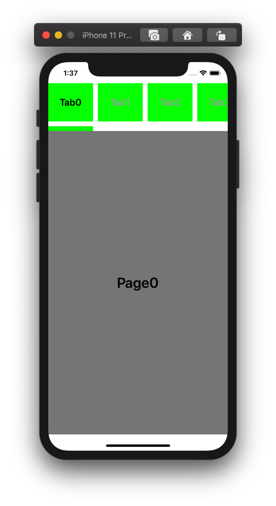
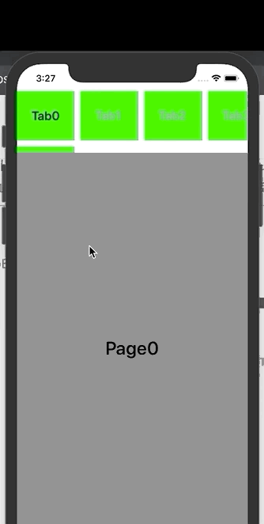

## CollectionView 이용 Page 탭바

***CollectionView을 사용하여 Paging이 가능한 탭바 커스텀***

<center></center>

 우선 생성을 위해 가장 상단의 화면을 구성하였다. 3가지 구성요소로 만들어져있다.

> ✔️ 페이지 표시를 위한 화면 👉 **UICollectionView**
>
> ✔️ 현재 페이지 밑에 Indicator View 👉 **UIView**
>
> ✔️ 가장 밑의 콘텐츠 표시를 위한 화면 👉 **UICollectionView**

<br>

 화면 구성의 셋팅이 끝났다고 가정하고 화면을 만들어보겠다. 이제 스크롤이나 탭을 클릭했을 때, 일어날 액션에 대한 정의가 필요하다. 기본적으로 다음과 같은 이벤트에 대한 동작이 필요하다.

✔️ 페이지 표시를 위한 Tabbar을 클릭했을 때

> 1️⃣ Indicator View가 현재 Tab이 터치 된 페이지로 이동함
>
> 2️⃣ 콘텐츠 표시를 위한 화면이 해당 페이지로 이동이 됨

<br>

 우선 기본적으로 CustomTabbar로 UIView을 상속받은 View을 만들어서 커스텀해주었다. 여기서 CustomTabbar을 구현한 ViewController에서 해당 스크롤이 되는 옵션을 지정해줄 수 있게 Delegate 패턴을 활용해 구현할 수 있게 하였다.

✅ **코드**

```swift
// 초기 설정을 위한 코드들
protocol CustomTabbarDelegate {
  // 선택된 페이지로 콘텐츠 뷰를 이동하는 기능
  func scrollTo(selectedIndex: IndexPath)
}

class CustomTabbar: UIView {
  var delegate: CustomTabbarDelegate?
  
  // Contraint을 코드로 지정하기 위한 모음
  private var customConstraints: [NSLayoutConstraint] = []
  private var selectedIndex: IndexPath = IndexPath(row: 0, section: 0)
	@IBOutlet weak var tabbarCollectionView: UICollecctionView!
  @IBOutlet weak var indicatorView: UIView!
  
  private func setConstraint() {
    indicatorView.translatesAutoresizingMaskIntoConstraints = false
    customConstraints = [indicatorView.leadingAnchor.constraint(equalTo: self.view.leadingAnchor)]
    NSLayoutConstraint.activate(customConstraints)

    indicatorView.bottomAnchor.constraint(equalTo: self.view.bottomAnchor).isActive = true
    indicatorView.widthAnchor.constraint(equalToConstant: self.view.bounds.width/4).isActive = true
    indicatorView.heightAnchor.constraint(equalToConstant: 10).isActive = true
    indicatorView.backgroundColor = .green
  }
}
```

<br>

 이제 직접적인 동작을 위한 코드들의 구현이 필요하다. 이를 위해 기본적으로 **CollectionView Delegate**을 이용한 작업이 필요하다. 그 중에서 Tabbar을 선택했을 때 일어날 액션들을 정의해야한다.

```swift
extension CustomTabbar: UICollectionViewDelegate {
  func collectionView(_ collectionView: UICollectionView, didSelectItemAt indexPath: IndexPath) {
    // 현재 선택된 Index을 저장
    selectedIndex = indexPath
    // IndicatorView와 AutoLayout을 맞추기 위한 선택된 셀을 가져옴
    guard let cell = colelctionView.cellForItem(at: selectedIndex) else { return }
		collectionView.scrollToItem(at: selctedItem, at: .centerHorizontally, animated: true)
    // 여기서 deactive해주는 작업이 필수이다. 
    // deactive해주는 작업이 없으면 이전 Constraints들과 중복 적용되어 이동하는 것을 확인할 수 없다.
    NSLayoutConstraint.deactive(customConstraints)
    // 새로운 셀과 Constraint 적용 
    customConstraints = [
      indicatorView.leadingAnchor.constraint(equalTo: cell.leadingAnchor),
      indicatorView.trailingAnchor.constraint(equalTo: cell.trailingAnchor)
    ]
    NSLayoutConstraint.activate(customConstraints)
    
    UIView.animate(withDuration: 0.7, delay: 0, usingSpringWithDamping: 0.7, initialSpringVelocity: 1, options: .curveEaseInOut, animations: {
      self.layoutIfNeeded()
    }, completion: nil)
    
    // 콘텐츠를 표시할 화면을 이동해주기 위한 작업 필요
    // Delegate에게 이동할 수 있게 시켜준다.
    delegate?.scrollTo(selectedIndex: selectedIndex)
  }
}

// 콘텐츠 화면으로 대신 이동해줄 View가 필요하다
extension ViewController: CustomTabbarDelegate {
  func scrollTo(selectedIndex: IndexPath) {
    // 선택된 Index로 스크롤
    contentCollectionView.scrollToItem(at: selectedIndex, at: .centerHorizontally, animated: true)
  }
}
```

<br>

 위의 코드까지는 Tabbar을 터치하여 액션이 일어났을 때, 다뤄주는 코드 부분이다. 이제 콘텐츠를 표시한 View에서도 스크롤을 수행했을 때, Tabbar들이 스크롤 될 수 있게 동기화시켜 주는 작업이 필요하다.

✔️ 콘텐츠를 나타내는 화면을 스크롤했을 때

> 1️⃣ Indicator View가 해당 페이지로 이동됨
>
> 2️⃣ Tabbar의 위치가 해당 페이지로 하이라이트됨

<br>

 이미 이전에 AutoLayout 설정으로 Indicator View와 Tabbar가 동기화되어 있기 때문에 큰 작업은 필요가 없다. 단지 스크롤이 되었을 때, Page을 계산해서 TabbarView에 전해주고 이동할 수 있게 구현하면 된다.

✅ **코드**

```swift
extension ViewController: UICollectionViewDelegate {
  func scrollViewWillEndDragging(_ scrollView: UIScrollView, withVelocity velocity: CGPoint, targetContentOffset: UnsafeMutablePointer<CGPoint>) {
    let page = Int(targetContentOffset.pointee.x / scrollView.frame.width)
    // Custom TabbarView의 탭바를 해당 페이지로 이동시켜주는 코드
    customTabbarViews.scrollScene(to: page)
  }
}

class CustomTabbar: UIView {
  func scrollScene(to page: Int) {
    selectedIndex = IndexPath(row: page, section: 0)
    // Item에 하이라이트되고 이동할 수 있게 선택해준다.
    tabbarCollectionView.selectItem(at: selectedIndex, animated: true, scrollPostion: .centeredHorizontally)
    // IndicatorView와 동기화되어 이동할 수 있게 설정해준다.
    collectionView(tabbarCollectionView, didSelectedItemAt: selectedIndex)
  }
}
```

<br>

<br>

✔️ **완성 화면**

 <center></center>